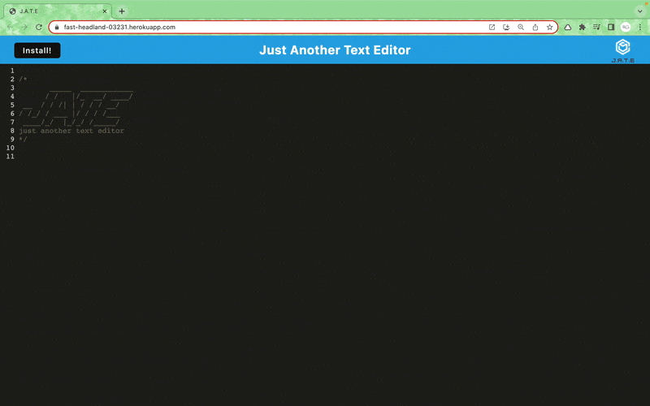
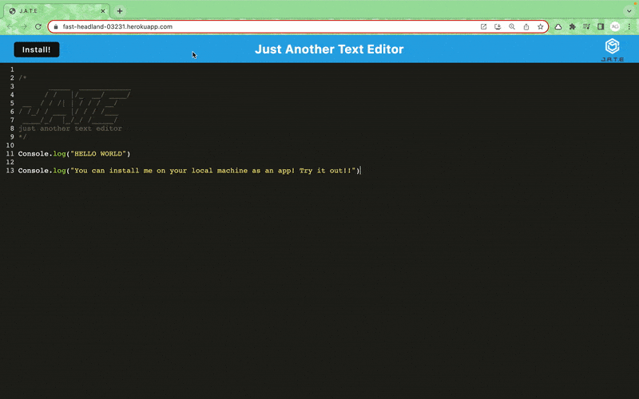

# Text.Editor

This project is a Progressive Web Application (PWA) for creating and managing notes or code snippets. The application is designed to work both online and offline, ensuring that your data is reliably saved and retrieved. It includes features such as IndexedDB for local storage, a service worker for offline capabilities, and the ability to install the app as a desktop icon.

### [Click to View Appplication](https://text-editor-uiqh.onrender.com/)

## **Built With:**
  + [JavaScript](https://developer.mozilla.org/en-US/docs/Web/JavaScript)
  + [Node.js](https://nodejs.org/en/)
  + [Express](https://www.npmjs.com/package/express)
  + [Concurrently](https://www.npmjs.com/package/concurrently)
  + [idb](https://www.npmjs.com/package/idb)
  + [Webpack](https://webpack.js.org/)
  + [Workbox](https://developer.chrome.com/docs/workbox/)

##  Installation
Users can access the Progressive Web Applications (PWA) Text Editor in the browser. If users would like to install the application to their local machine they can do so by clicking the `Install` button located in the application. 

## Questions

For any questions or feedback, please open an issue or contact  through my github https://github.com/Nimo20